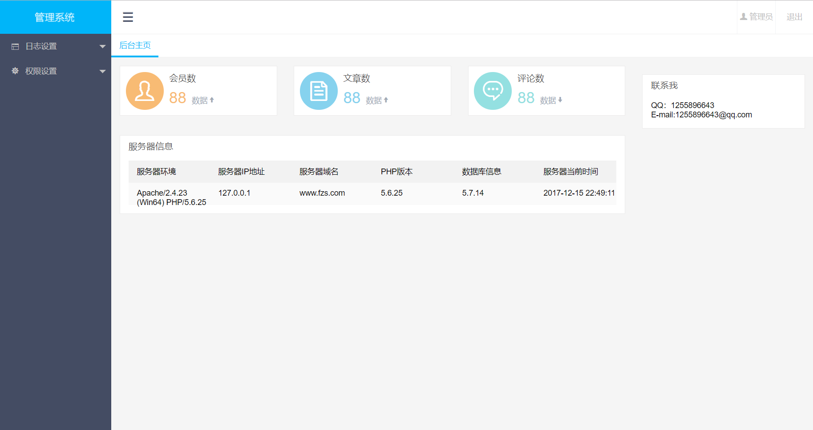
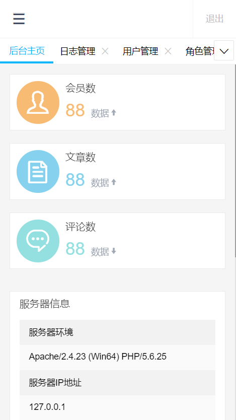
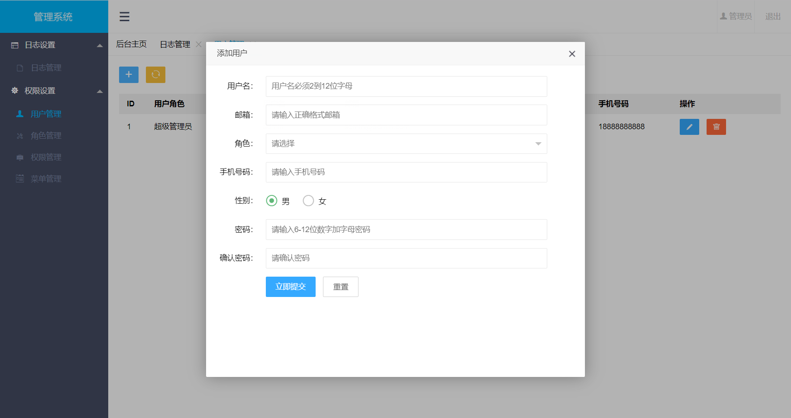
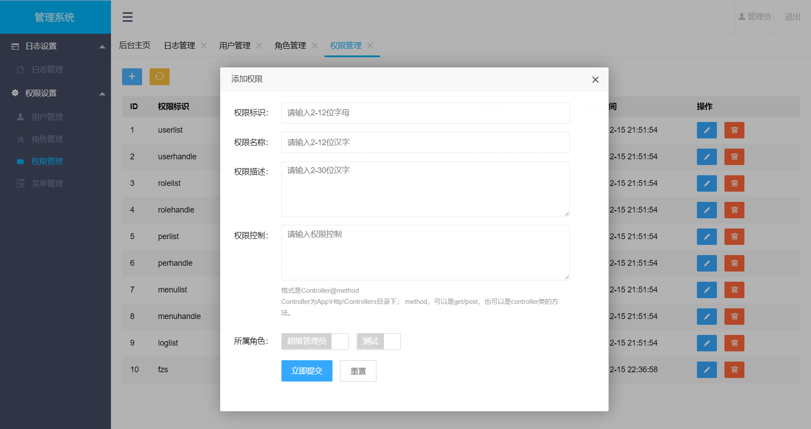
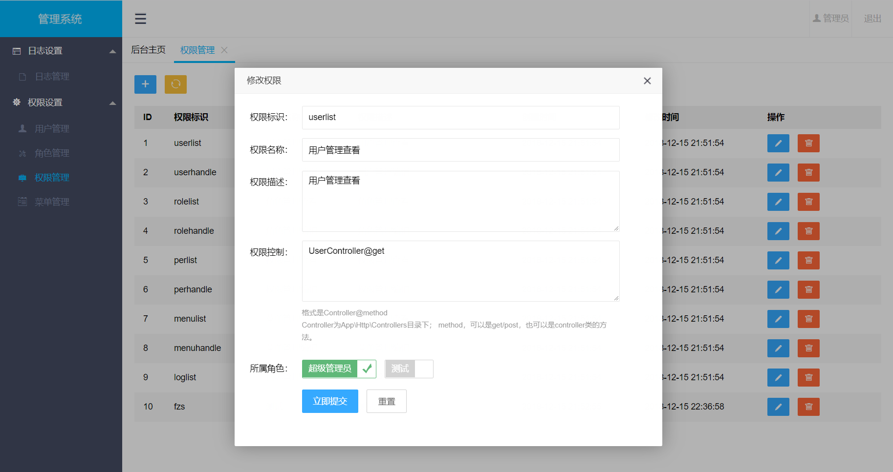
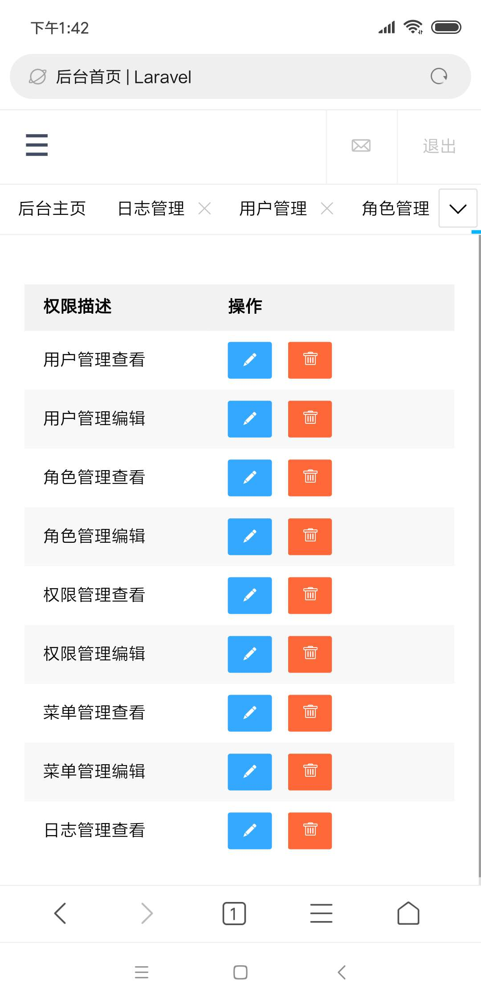
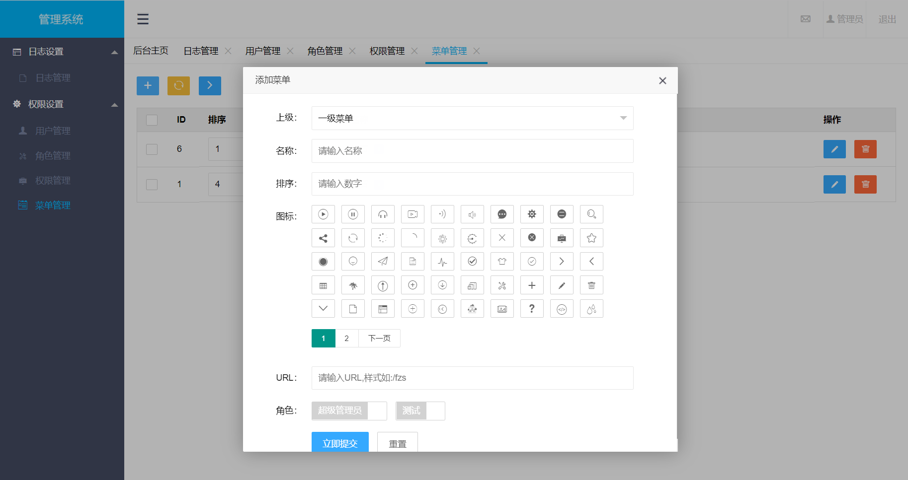
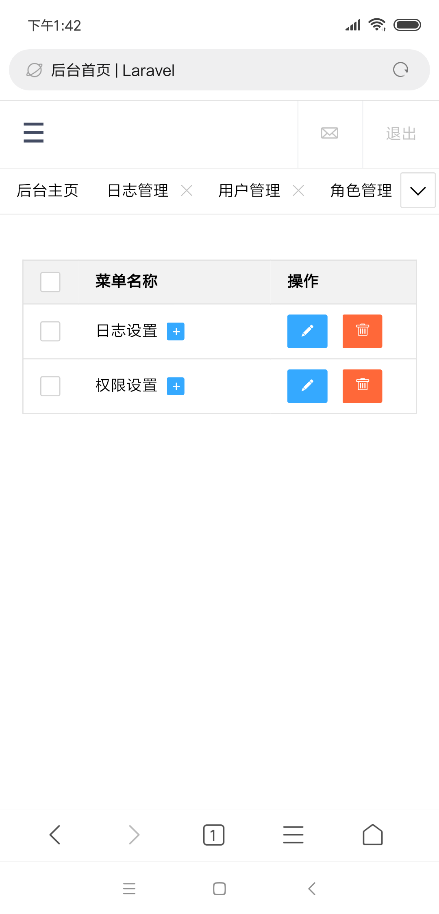
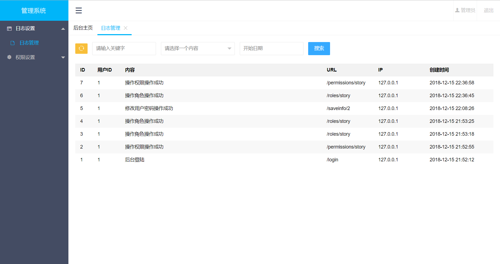
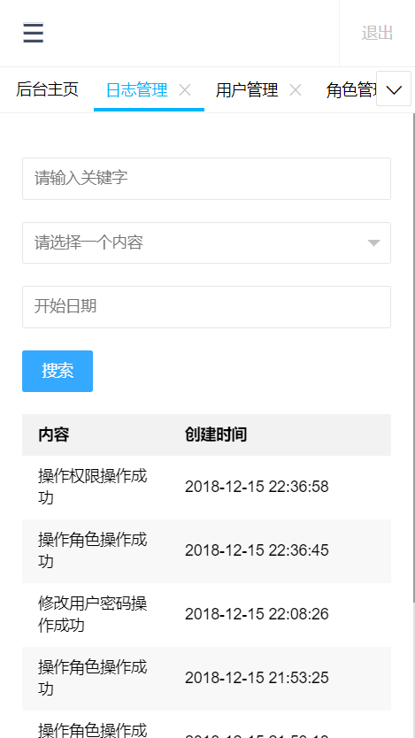

f-admin基础权限后台
===============
❤️ 本项目 [GitHub](https://github.com/fangzesheng/f-admin) / [Gitee(码云)](https://gitee.com/fzsfzs/f-admin)，目前已在公司产品应用，运行在数个客户服务器内。

f-admin基础权限后台是一套基于Laravel框架开发的系统，不需要开发者重复不必要的工作，就可以实现后台功能的快速开发，其主要特点包括：
- [x] 集成 Composer，安装使用方便。
- [x] 用户管理可以配置自己的权限。
- [x] 角色管理可以配置用户及权限。
- [x] 权限控制可以精确到某一个请求的控制。
- [x] 菜单可以设置自己的图标，可以控制哪些角色可以看到。
- [x] 日志查看搜索。
- [x] 严格的前端后端输入验证。
- [x] pc端和手机端都能适配。
- [ ] 其它优化，持续进行中 ......

> f-admin的运行环境要求PHP5.4及以上；Laravel 框架要求为5.4及以上（默认是5.4，如果要使用laravel高版本，请先在composer install之前修改composer.json文件）。

线上DEMO [f-admin](http://f-admin.fang99.cc)   
你也可以用手机扫下二维码查看手机效果 

## 导航

  * [效果预览](#效果预览pcmobile)
  	- [首页](#首页)
  	- [用户管理](#用户管理)
  	- [角色管理](#角色管理)
  	- [权限管理](#权限管理)
  	- [菜单管理](#菜单管理)
  	- [日志管理](#日志管理)
  * [安装步骤](#安装步骤)
  	- [1.获取代码](#1获取代码)
  	- [2.安装依赖](#2安装依赖)
  	- [3.生成APP_KEY](#3生成APP_KEY)
  	- [4.修改`env`配置](#4修改-env-配置)
  	- [5.数据库迁移](#5数据库迁移)
  	- [6.访问首页](#6访问首页)
  * [环境配置](#环境配置仅供参考)
  	- [1.windows](#1windows)
  	- [2.linux(apache)](#2linuxapache)
  	- [3.linux(nginx)](#3linuxnginx)
  * [感谢](#感谢)
## 效果预览(pc/mobile)

#### 首页

  

#### 用户管理

#### 角色管理

#### 权限管理

#### 菜单管理

#### 日志管理

## 安装步骤
#### 1.获取代码
新建一个文件夹，进入该文件夹，利用git等工具输入以下命令：

    git init  
    git clone https://github.com/fangzesheng/f-admin.git
#### 2.安装依赖
    composer install  
#### 3.生成APP_KEY
    cp .env.example .env
    php artisan key:generate  
#### 4.修改 `.env` 配置
    DB_CONNECTION=mysql
    DB_HOST=your_host
    DB_PORT=your_port
    DB_DATABASE=your_db
    DB_USERNAME=your_username
    DB_PASSWORD=your_pwd
    CACHE_DRIVER=array  //将file改为array
#### 5.数据库迁移
    php artisan migrate
    composer dump-autoload
    php artisan db:seed
> 如果在执行php artisan migrate增加表操作出现字段长度过长错误时，则可能是因为mysql版本低于5.5.3，解决方法：  
- a.升级mysql  
- b.手动配置迁移命令migrate生成的默认字符串长度，在app\Providers\AppServiceProvider中调用一下方法来实现配置  
>记得先将新建数据库里面的表清空！！！

    use Illuminate\Support\Facades\Schema;    
    public function boot()
    {
       Schema::defaultStringLength(191);
    }
#### 6.访问首页
访问自己的配置好的域名  
用户名：admin  
密码：f123456

## 环境配置（仅供参考）
#### 1.windows
    <VirtualHost *:80>
        DocumentRoot E:\test\public
        ServerName www.test.com
        <Directory "E:\test\public">
           AllowOverride All
           order deny,allow
           Require all granted
        </Directory>
    </VirtualHost>
#### 2.linux(apache)
    <VirtualHost *:80>
        DocumentRoot /data/wwwroot/default/f-admin/public
        ServerName www.fang99.cc
        <Directory "/data/wwwroot/default/f-admin/public">
           AllowOverride All
           order deny,allow
           Require all granted
        </Directory>
    </VirtualHost>
#### 3.linux(nginx)
    server {
        listen       8088;
        server_name  demo.fang99.cc;
        location / {
            index index.php index.html;
            root /var/www/f-admin/public/;
            try_files $uri $uri/ /index.php?$query_string;
        }
        location ~ \.php$ {
            root   /var/www/f-admin/public/;
            fastcgi_pass 127.0.0.1:9000;
            fastcgi_index index.php;
            fastcgi_param  SCRIPT_FILENAME  $document_root$fastcgi_script_name;
            fastcgi_intercept_errors on;
            include /etc/nginx/fastcgi.conf;
        }
    }
## 感谢

- [layer](http://layer.layui.com/)
- [laravel](https://laravel.com/)

如果你觉得这个开源项目对你有用，你懂的！谢谢：）
